# SuperMap iObjects Java Maven 快速接入指南

本文用于把本地 SuperMap iObjects Java SDK 接入 Maven 项目。

适用环境：

```text
Windows 10 / 11
JDK 1.8
Maven 3.x
SuperMap iObjects Java SDK
```

本项目作业要求使用 Java + SuperMap iObjects Java，并实现 GUI、工作空间、数据源、数据集、地图、图层、查询等功能。

## 1. 准备 SDK

假设 SuperMap SDK 解压在：

```text
D:\supermap\supermap-iobjectsjava-2025u1-win-all
```

管理员运行一次：

```text
D:\supermap\supermap-iobjectsjava-2025u1-win-all\Install_x64.bat
```

然后验证官方示例是否能打开：

```bat
cd /d D:\supermap\supermap-iobjectsjava-2025u1-win-all\SampleCode
java -jar Startup.jar
```

能打开 GUI，说明 SDK、License、运行环境基本可用。

## 2. 导入 SuperMap jar 到 Maven 本地仓库

在项目根目录创建：

```text
scripts/install-supermap-jars.ps1
```

复制以下内容：

```powershell
# 修改成你的 SuperMap SDK 路径
$superMapHome = "D:\supermap\supermap-iobjectsjava-2025u1-win-all"

# Maven 坐标版本，可按 SDK 版本自行修改
$version = "2025u1"
$groupId = "com.supermap.local"

$jarDir = Join-Path $superMapHome "Bin"
$tempPomDir = "D:\supermap\maven-poms"

if (!(Test-Path $jarDir)) {
    Write-Host "SuperMap Bin directory not found: $jarDir" -ForegroundColor Red
    exit 1
}

if (!(Test-Path $tempPomDir)) {
    New-Item -ItemType Directory -Path $tempPomDir | Out-Null
}

$localRepo = (mvn help:evaluate "-Dexpression=settings.localRepository" -q "-DforceStdout").Trim()
$supermapRepo = Join-Path $localRepo "com\supermap\local"

Write-Host "Maven local repository: $localRepo"
Write-Host "SuperMap jar directory: $jarDir"

# 清理旧的 SuperMap 本地依赖，避免旧 POM 污染
if (Test-Path $supermapRepo) {
    Write-Host "Deleting old SuperMap local artifacts: $supermapRepo"
    Remove-Item $supermapRepo -Recurse -Force
}

Get-ChildItem $jarDir -Filter "*.jar" | ForEach-Object {
    $artifactId = [System.IO.Path]::GetFileNameWithoutExtension($_.Name)
    $pomPath = Join-Path $tempPomDir "$artifactId.pom"

    $pomContent = @"
<project xmlns="http://maven.apache.org/POM/4.0.0"
         xmlns:xsi="http://www.w3.org/2001/XMLSchema-instance"
         xsi:schemaLocation="http://maven.apache.org/POM/4.0.0 https://maven.apache.org/xsd/maven-4.0.0.xsd">
    <modelVersion>4.0.0</modelVersion>
    <groupId>$groupId</groupId>
    <artifactId>$artifactId</artifactId>
    <version>$version</version>
    <packaging>jar</packaging>
</project>
"@

    Set-Content -Path $pomPath -Value $pomContent -Encoding UTF8

    Write-Host "Installing $($_.Name) as ${groupId}:${artifactId}:${version}"

    mvn install:install-file `
        "-Dfile=$($_.FullName)" `
        "-DpomFile=$pomPath"
}

Write-Host "SuperMap jars installed successfully." -ForegroundColor Green
```

执行：

```powershell
powershell -ExecutionPolicy Bypass -File .\scripts\install-supermap-jars.ps1
```

验证：

```powershell
mvn dependency:get "-Dartifact=com.supermap.local:com.supermap.data:2025u1"
```

没有报错即可。

## 3. pom.xml 添加依赖

在你的 Maven 项目 `pom.xml` 中加入：

```xml
<properties>
    <maven.compiler.source>1.8</maven.compiler.source>
    <maven.compiler.target>1.8</maven.compiler.target>
    <project.build.sourceEncoding>UTF-8</project.build.sourceEncoding>
    <supermap.version>2025u1</supermap.version>
</properties>

<dependencies>
    <dependency>
        <groupId>com.supermap.local</groupId>
        <artifactId>com.supermap.data</artifactId>
        <version>${supermap.version}</version>
    </dependency>

    <dependency>
        <groupId>com.supermap.local</groupId>
        <artifactId>com.supermap.mapping</artifactId>
        <version>${supermap.version}</version>
    </dependency>

    <dependency>
        <groupId>com.supermap.local</groupId>
        <artifactId>com.supermap.ui.controls</artifactId>
        <version>${supermap.version}</version>
    </dependency>

    <dependency>
        <groupId>com.supermap.local</groupId>
        <artifactId>com.supermap.data.cloudlicense</artifactId>
        <version>${supermap.version}</version>
    </dependency>
</dependencies>
```

如果后续提示缺少其他 SuperMap 包，就按 jar 文件名继续加依赖。

例如：

```text
com.supermap.analyst.spatialanalyst.jar
```

对应：

```xml
<dependency>
    <groupId>com.supermap.local</groupId>
    <artifactId>com.supermap.analyst.spatialanalyst</artifactId>
    <version>${supermap.version}</version>
</dependency>
```

## 4. 最小验证代码

创建：

```text
src/main/java/com/example/supermap/Main.java
```

写入：

```java
package com.example.supermap;

import com.supermap.data.Workspace;

public class Main {
    public static void main(String[] args) {
        Workspace workspace = new Workspace();
        System.out.println("SuperMap Workspace 创建成功：" + workspace);
    }
}
```

执行：

```bat
mvn clean compile
```

编译成功说明 Maven 依赖已接入。

## 5. IDEA 运行配置

如果运行时报 native library 错误，在 IDEA 中配置：

```text
Run → Edit Configurations → VM options
```

加入：

```text
-Djava.library.path=D:\supermap\supermap-iobjectsjava-2025u1-win-all\Bin
```

请从本机 SuperMap iObjects Java SDK 的 SampleData 目录复制演示数据到此目录；本仓库不提交官方示例数据。

## 6. 功能示例截图

以下截图展示了本作业程序（`HwkMainFrame`）的完整使用流程：从打开工作空间、加载地图，到 SQL 查询、空间查询、统计信息等核心功能。

截图文件位于 `src/docs/screenshots/`，如有缺失或显示异常，请联系作者邮箱：`luoxiongcai5@gmail.com`。

### 6.1 打开工作空间 — 定位示例数据

启动程序后点击「打开工作空间」按钮，在弹出的文件选择对话框中进入 SuperMap iObjects Java SDK 安装目录，从其中的 `SampleData` 文件夹中选取示例数据。

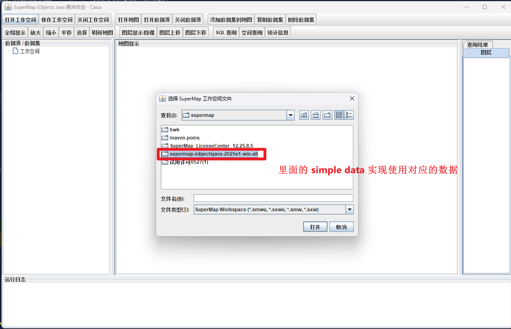

### 6.2 选择示例工作空间文件

示例使用的是长春地图，选中 `City\Changchun.smwu` 后点击「打开」。

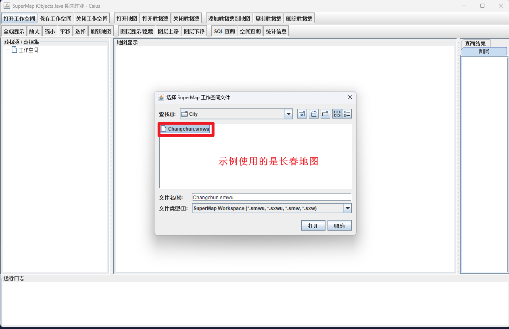

### 6.3 工作空间与地图加载完成

打开后，左侧「数据源/数据集」树会展示工作空间内容，中央地图区显示「长春市区图」，运行日志会输出工作空间与地图打开成功的信息。

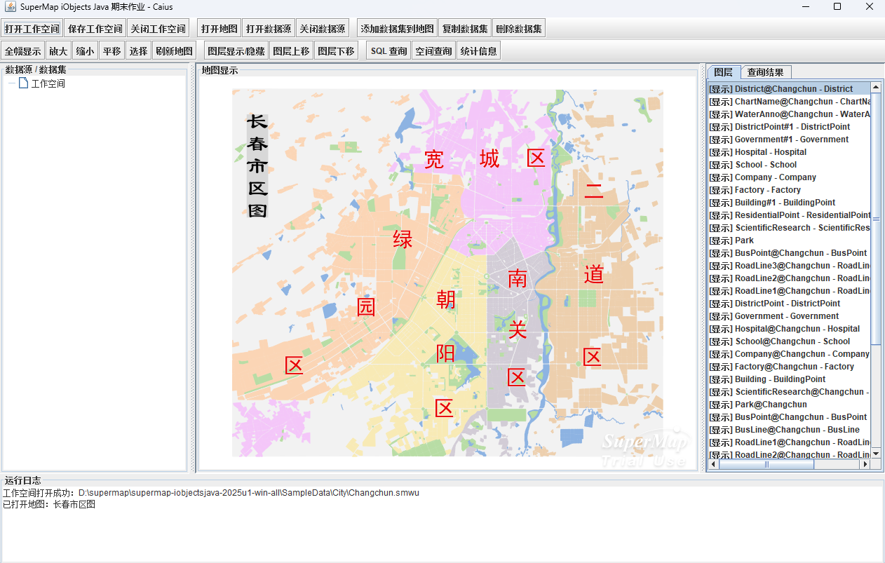

### 6.4 地图导航操作

工具栏第二行提供「全幅显示 / 放大 / 缩小 / 平移 / 选择 / 刷新地图」等操作。点击对应图标即可切换交互模式；后续空间查询也需要先使用「选择」操作。

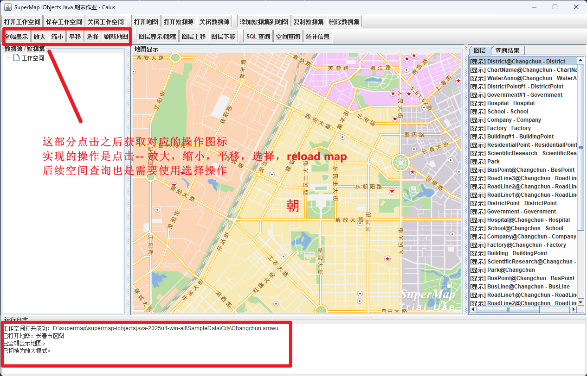

### 6.5 打开数据源（.udb 文件）

同样在 `SampleData` 文件夹中，点击「打开数据源」选择对应的 `.udb` 文件即可加载额外的数据源。

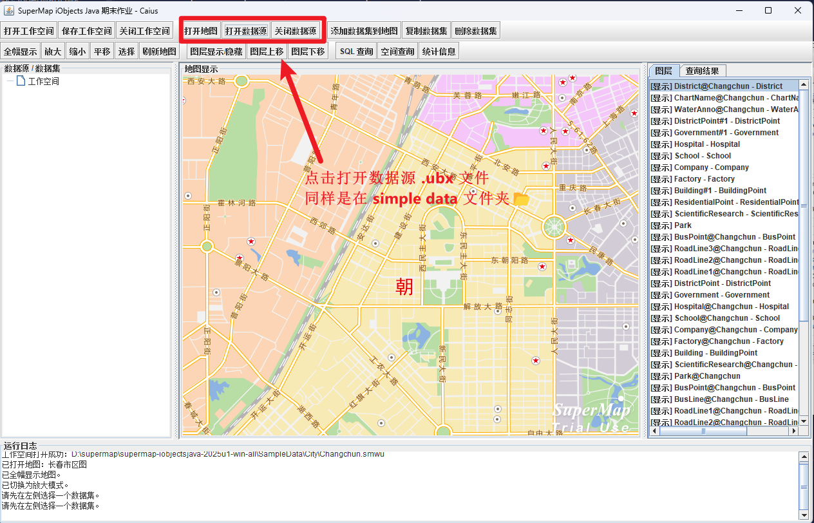

### 6.6 数据源 / 数据集列表

打开数据源后，左侧树视图列出全部数据集（点、线、面、文本等），右侧「图层」标签页显示当前地图中已加载的图层。

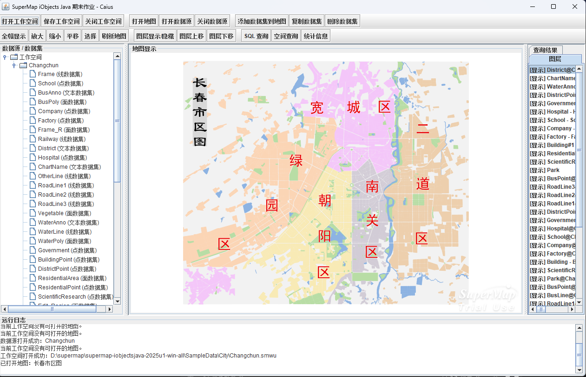

### 6.7 添加数据集到地图

在左侧选中某个数据集（例如 `Railway`），然后点击工具栏「添加数据集到地图」按钮，即可将该数据集作为新图层加入当前地图，运行日志会提示添加结果。

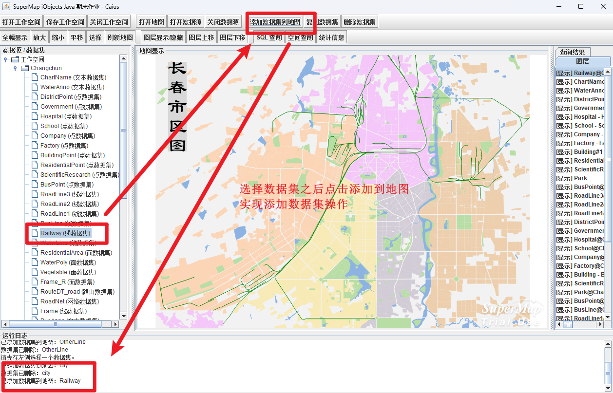

### 6.8 SQL 查询 — 输入条件

点击工具栏「SQL 查询」按钮，在弹出的对话框中选择目标数据集并输入 SQL 条件（默认 `SmID > 0`，可改为 `SmID > 10` 等条件进行比对查询）。

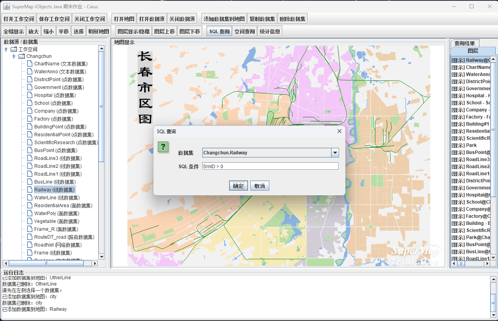

### 6.9 SQL 查询 — 结果展示

查询完成后，右侧「查询结果」标签页以表格形式展示命中记录的全部属性字段，运行日志会输出命中条数与表格显示条数。

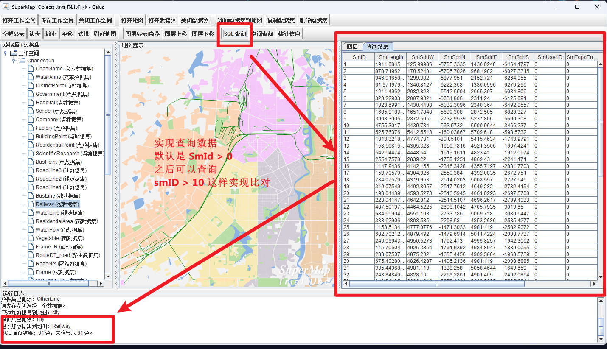

### 6.10 空间查询

先使用「选择」工具在地图上选中一个对象（例如 Railway 中的某条线），再点击「空间查询」按钮，程序会返回该对象对应的属性数据，并在运行日志中输出查询条数。建议先添加数据集再进行空间查询，效果更明显。

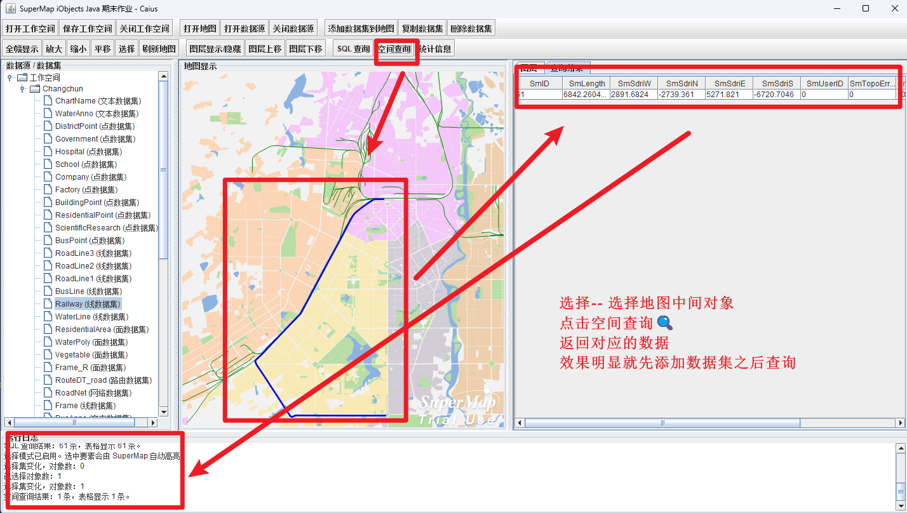

### 6.11 统计信息

点击工具栏「统计信息」按钮，弹窗中会汇总当前工作空间的地图数、数据源数、数据集数、当前地图图层数，以及选中数据集的记录数。

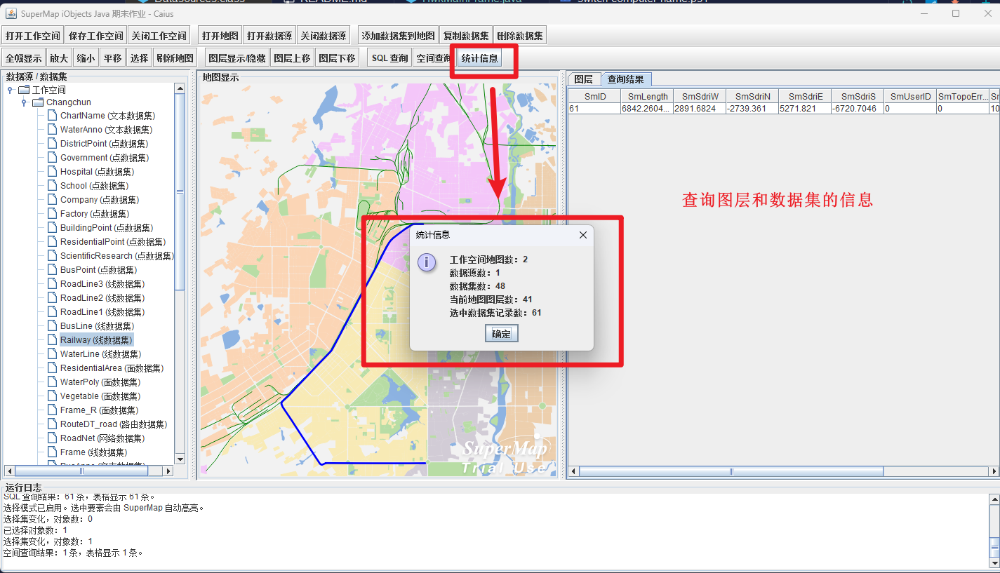


